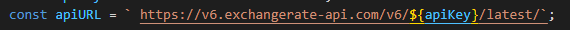

# Conversor de Moedas com API

* [Introduçao](#introdução)
* [Descrição](#descrição)
* [Funcionalidades](#funcionalidades)
* [Resultado](#resultado)
* [Fontes](#fontes)
* [Autora](#autora)
* [Orientador](#orientador)

## Introdução 

Este projeto é uma extensão atualizada do trabalho desenvolvido anteriormente, [Conversor de Moedas Simples](https://github.com/manuelaaraujo/conversor-de-moeda), que visa criar uma aplicação web para conversão de moedas utilizando a API. Utilizando HTML5, CSS3 e JavaScript puro, a aplicação permite que o usuário insira um valor, escolha moedas de origem e destino, e obtenha a conversão em tempo real, com cotações atualizadas diretamente de uma API de câmbio. A interface foi projetada para ser simples e intuitiva, garantindo fácil uso e uma experiência de conversão eficiente e precisa. Além disso, a aplicação inclui tratamento de erros para garantir uma experiência confiável, mesmo em casos de falha na conexão com a API.

## Descrição

## `Atualizações do projeto`

A atualização permite que o código faça a conversão de moedas usando a API para obter taxas em tempo real ou, alternativamente, usando taxas fixas definidas em um objeto exchangeRates, caso a API não seja utilizada. Além disso, ele verifica se a moeda de origem e a de destino são iguais e, nesse caso, retorna o valor original sem realizar a conversão.

### `Configuração da API:`

    Define uma chave de API (apiKey) e uma URL base (apiURL) para acessar os dados de taxas de câmbio em tempo real.

### `Função:`

    * Recebe duas moedas como parâmetros `(deMoeda e paraMoeda)` e faz uma solicitação assíncrona à API para obter a taxa de câmbio.

    * Utiliza `fetch` para fazer uma requisição HTTP à API e converte a resposta para JSON.

    * Verifica se o resultado da resposta é `success`. Caso positivo, retorna a taxa de câmbio `(data.conversion_rates[paraMoeda])`. Se não, lança um erro.

    * Em caso de erro durante a execução, exibe-o no console e retorna `null`.

### `Manipulação do Formulário de Conversão:`

    Adiciona um listener ao formulário de conversão `(currency-form)`. Quando o formulário é enviado, ele impede o comportamento padrão de envio para evitar o recarregamento da página.

    Lê o valor inserido para conversão `(amount)` e as moedas de origem e destino escolhidas pelo usuário.
    `valor:` obtém e converte o valor a ser convertido em número.
    `deMoeda:` captura a moeda de origem.
    `paraMoeda:` captura a moeda de destino.

    Essa parte do código busca a taxa de câmbio da API e, se obtida com sucesso `(exchangeRate)`, calcula o valor convertido multiplicando o valor de entrada pela taxa de câmbio.

    exibe o resultado da conversão ou uma mensagem de erro:

    `const conversao = document.getElementById('conversao');`: Seleciona o elemento da página onde o resultado será mostrado.

    `**conversao.textContent = \Resultado: ${convertedValue.toFixed(2)} ${paraMoeda}`;**: Define o texto do elemento conversao` para exibir o valor convertido com duas casas decimais e o código da moeda de destino.

    `else { alert('Erro ao buscar a cotação. Tente novamente'); }:` Caso a taxa de câmbio não seja obtida, exibe uma mensagem de erro ao usuário.

## Funcionalidades 

A funcionalidade desse código é permitir que um usuário converta valores entre diferentes moedas, utilizando taxas de câmbio atualizadas em tempo real. O código faz isso ao:

* Permitir que o usuário insira um valor e escolha as moedas de origem e destino.
* Buscar a taxa de câmbio entre as moedas selecionadas usando uma API.
* Calcular o valor convertido com base na taxa de câmbio obtida.
* Exibir o resultado da conversão na interface.
* Exibir uma mensagem de erro caso haja algum problema ao buscar a taxa de câmbio.
* Em resumo, a principal funcionalidade é realizar conversões de moeda com cotações em tempo real, de forma simples e interativa.

## Resultado

## Fontes 
[Mdn Web Docs](https://developer.mozilla.org/pt-BR/)

[Chat GPT](https://chatgpt.com/)

## Autora 

[Manuela Araujo dos Santos](https://github.com/manuelaaraujo)

## Orientador

[Leonardo Rocha](https://github.com/LeonardoRochaMarista)